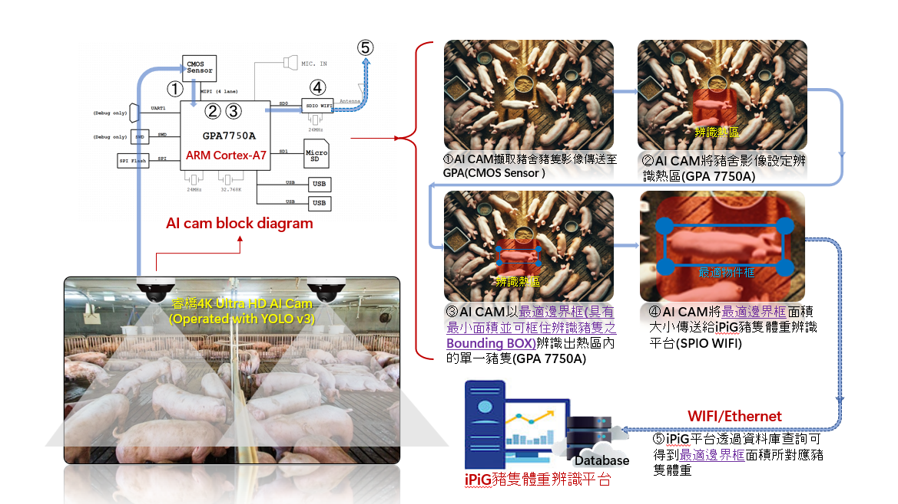
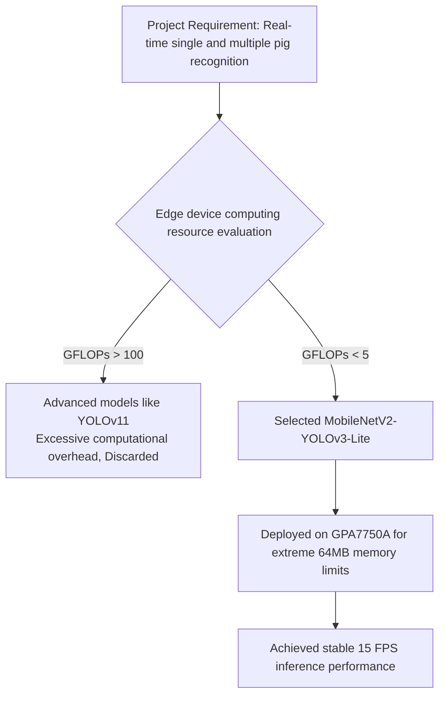
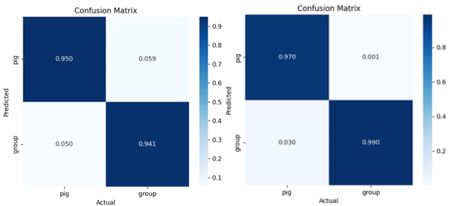
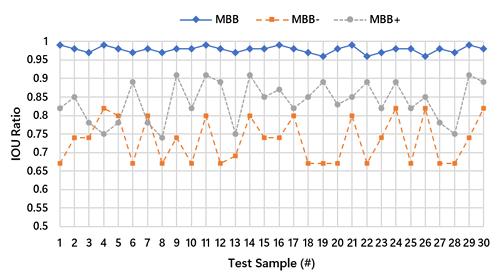

# PigView: A Minimum Bounding-Box Pig Weight Estimation System Using Artificial Intelligence Deep Learning 🐷
> **Technical Specification & System Architecture**
> 
> This project proposes a non-contact pig weight estimation system based on artificial intelligence deep learning—**PigView**, specifically designed to evaluate and manage the growth status of pigs in pigsties. Utilizing AI cameras equipped with model inference capabilities, this system deeply integrates on-device Edge Computing with Minimum Bounding Box (MBB) area conversion technology.
>
> PigView can not only be easily and cost-effectively deployed in pig farms, solving the pain points of traditional manual measurement being time-consuming, labor-intensive, and carrying safety risks; but by establishing a **Region of Interest (ROI)** as a spatial constraint to filter valid postures, it successfully overcomes technical interferences caused by animal posture deformation. Experimental results show that this system can automatically and accurately track pig weight changes and growth trends, assisting pig farmers in optimizing breeding and production efficiency, thereby achieving high commercial deployment value in reducing costs and increasing revenue.

## 1. System Architecture and Edge Deployment (System Architecture)

This system adopts a "monocular real-time inference" architecture, utilizing the GPA7750A SoC with an ARM Cortex-A7 processor and a built-in second-generation Deep Learning Accelerator (GPDLAv2) as the main computing unit. The complete pipeline of the overall system is shown in the figure below:



*(Figure 1: Software and hardware integration and monocular real-time inference pipeline of the PigView system)*


### 1.1 Hardware Specifications and Edge Performance
In edge computing scenarios, hardware resources are often the biggest bottleneck. This project transforms severe hardware constraints into the baseline for architecture design, achieving an excellent performance balance:
- **Extreme Hardware Constraints**: The computing core GPA7750A has a maximum computing power of `17.32 GFLOPs`. The built-in memory (DDR2) is **`64 MB`**, and the memory bandwidth is only **`1.6 GB/s`**.
- **System Performance**: The system stably maintains an inference speed of **15 FPS**, meeting the real-time computing requirements of practical farms.

## 2. Core Technology and Feature Engineering (Core Methodology)

### 2.1 Lightweight Model Selection and Hardware Adaptation (Model Selection & Hardware Adaptation)
Addressing the extremely limited computing resources of edge hardware, we conducted a trade-off analysis on the performance and practicality of deep learning models. We discarded massive, state-of-the-art network architectures in favor of **MobileNetV2-YOLOv3-Lite**:

| Model | GFLOPs | Model Size | Mem Bandwidth | Compatibility |
|---|---|---|---|---|
| YOLOv11 | 160 | 100 MB | 18 GB/s | ❌ N/A |
| **YOLOv3-Lite** | **3~4** | **10~12 MB** | **1 GB/s** | ✅ **Fully Compatible** |



Although advanced models like YOLOv11 hold an advantage in overall theoretical accuracy, their computational overhead of up to 160 GFLOPs simply cannot be deployed on edge devices with 64MB of memory. According to the confusion matrix experimental results of this project, the MobileNetV2-YOLOv3-Lite model achieved a Recall value higher than 0.94 for both single and multiple pigs.

 

*(Figure 2: The confusion matrix of MobileNetV2-YOLOv3-Lite adopted in this project on the left, and the control group YOLOv11 on the right. This proves the lightweight model has a high cost-performance ratio and sufficient Recall performance.)*

### 2.2 Offline Augmentation and Overcoming Framework Limitations (Offline Augmentation Strategy)

To compensate for the inherent limitations of lightweight models in complex scenarios, we introduced a rigorous **Offline Augmentation** strategy to maximize the system's generalization capabilities. Since the MobileNetV2-YOLOv3-Lite used in this project is built on the underlying **Darknet framework**, its native data loading pipeline makes it difficult to directly integrate modern packages like Albumentations for highly complex, dynamic Online Augmentation. Therefore, we decisively adopted an offline augmentation strategy, expanding the baseline data to 20,000 images in advance through geometric and pixel-level transformations such as dynamic brightness and contrast adjustments, and Mosaic blending. This engineering decision not only resolved framework limitations but also ensured that the model can accurately lock onto pig contours amidst real pigsty lighting variations and environmental noise, providing a stable and reliable baseline for area conversion.

### 2.3 MBB Single-Pig Dataset Construction and Automated Annotation (MBB Single-Pig Dataset Construction)

This project defines images without overlap with other individuals as "**Single-Pig**". To break through the efficiency bottleneck of traditional manual annotation, this research developed an in-house automated annotation tool, **LabelMini**, dedicated to precisely extracting the "**Minimum Bounding Box (MBB)**" that perfectly envelopes the pig's torso.

For single-pig images, LabelMini sequentially executes an image processing pipeline: **Grayscale Conversion $\rightarrow$ Gaussian Blur $\rightarrow$ Binarization $\rightarrow$ Edge Detection**, to accurately extract the target's external contour. Once the edges are locked, the system automatically calculates and generates a rectangular box (MBB) possessing the mathematical characteristic of "absolute minimum area." Through this automated process, the project is able to efficiently construct a highly accurate single-pig MBB dataset on a large scale.

Ultimately, this system adopts **MobileNetV2-YOLOv3-Lite** as the Core Model, and integrates the aforementioned single-pig and multi-pig datasets for joint training. This ensures the model can accurately detect and adapt to various target states falling within the **ROI (Region of Interest)**, significantly enhancing generalization capabilities in practical fields.

### 2.4 Area to Physical Weight Mapping Model (Area-to-Weight Mapping)

Based on the fixed projection plane assumption, after the system extracts the MBB pixel area, it utilizes Quadratic Polynomial Regression to establish a non-linear mapping relationship between 2D area and 3D weight. Its core mathematical model is defined as follows:

$$
\hat{W} = \alpha \cdot A_{MBB}^2 + \beta \cdot A_{MBB} + \gamma
$$

Where $\hat{W}$ is the estimated weight (kg), $A_{MBB}$ is the MBB pixel area of a single pig, and $\alpha, \beta, \gamma$ are environmental parameters pre-fitted based on different camera heights.

To ensure the stability of area calculation, the core processing logic of the LabelMini automated annotation pipeline is shown below:

```python
import cv2
import numpy as np

def extract_mbb(image_path):
    # 1. Grayscale and Gaussian denoising
    img = cv2.imread(image_path, cv2.IMREAD_GRAYSCALE)
    blurred = cv2.GaussianBlur(img, (5, 5), 0)
    
    # 2. Otsu binarization and morphological processing (Remove mud interference)
    _, binary = cv2.threshold(blurred, 0, 255, cv2.THRESH_BINARY + cv2.THRESH_OTSU)
    kernel = np.ones((3,3), np.uint8)
    clean_binary = cv2.morphologyEx(binary, cv2.MORPH_OPEN, kernel)
    
    # 3. Edge detection and Minimum Bounding Box (MBB) generation
    contours, _ = cv2.findContours(clean_binary, cv2.RETR_EXTERNAL, cv2.CHAIN_APPROX_SIMPLE)
    largest_contour = max(contours, key=cv2.contourArea)
    x, y, w, h = cv2.boundingRect(largest_contour)
    
    return (x, y, w, h) # Return MBB coordinates and dimensions
```

## 3. System Limitation Design and Practical Considerations (System Defense & Domain Knowledge)

If pigs present non-standard postures such as lying on their sides or curling up, it will inevitably lead to area distortion and weight calculation errors. Addressing this technical limitation, this project abandoned extremely compute-intensive, complex algorithms, and instead adopted an optimal system design combined with field practices to solve it:

### 3.1 Spatial Constraints and **ROI (Region of Interest)**
Within the AI camera, we established a narrow **ROI (Region of Interest)**. This physical spatial design forces the system to **only measure the pig's weight when it "walks forward and passes upright" through this predefined ROI**. Through this physical constraint, the system directly eliminates invalid postures from the source—such as curling up or lying down—that would cause area calculation errors, ensuring that the features written to the database possess high consistency and reliability.

### 3.2 Breeding Practical Considerations
Addressing the concern that "strict ROI conditions may lead to fewer successfully recorded samples daily," we combined the management experience of frontline pig farms to establish the high rationality of this design in real-world scenarios:

1. **Practical Benefits of Automated Measurement**: Traditional manual weighing is extremely time-consuming and labor-intensive, and forced driving easily induces severe physiological stress in pigs, subsequently affecting health and meat quality. For farm managers, as long as the system can "automatically record partial data daily," it has already significantly saved labor costs. In practice, there is absolutely no need to demand 100% full-time, indiscriminate tracking.
2. **Pen-Level Growth Consistency**: According to practical breeding experience, pigs raised in the same pen share the same feeding conditions and environment, so their growth curves possess high consistency. Therefore, even if the system repeatedly samples the same frequently moving pig within the ROI, statistically (Law of Large Numbers), it can further smooth out the error of a single measurement, generating an extremely stable "pen average growth trend line." For the farm's current management goals, grasping this group trend is sufficient to accurately evaluate the growth status.
3. **Modular Upgrade Path**: Although current partner farms primarily focus on group trend evaluation, this system architecture has reserved expansion flexibility. If there are refined management needs for breeding pigs or high-value individuals in the future, the system can seamlessly integrate edge-side object tracking algorithms or combine physical RFID tags to achieve a comprehensive upgrade from "group average estimation" to "individual tracking profiles."

## 4. Experimental Results and Performance Evaluation (Empirical Results)

### 4.1 Bounding Box Size Comparison Experiment: MBB Accuracy Validation
To verify "the impact of precise bounding box size on weight estimation," we conducted comparison experiments on different bounding strategies. The figure below demonstrates the performance comparison of the MobileNetV2-YOLOv3-Lite model predicting on MBB (precise box), MBB- (shrunken box), and MBB+ (enlarged box) single-pig datasets, respectively.

This experiment adopted Intersection over Union (IoU) as the performance metric to measure the degree of overlap between the predicted bounding box and the actual annotated box. Experimental data clearly indicates: among the 30 randomly sampled test instances, only the model trained based on MBB could stably converge the IoU to an extremely high level approaching 1.0; conversely, as long as the bounding area deviated from the baseline, the prediction accuracy exhibited highly unstable oscillations. This provides empirical evidence from the data level: **A precisely fitting MBB is the optimal measurement baseline for area calculation accuracy**.



*(Figure 3: Comparison of IOU performance of MobileNetV2-YOLOv3-Lite model with MBB, MBB-, and MBB+ single-pig datasets.)*

### 4.2 Practical Field Dynamic Weight Estimation Validation (3-Week Tracking)
To ensure system stability, this experiment adopted a camera setup with a fixed height and top-down viewing angle. Addressing environmental differences in various pigsties, the system can expand baseline datasets for different camera heights and utilize configuration files to switch corresponding parameters during on-site deployment, balancing the lightweight nature of edge computing with cross-field adaptability.
To validate the system's temporal generalization capability in actual farm environments, we randomly sampled 10 pigs (initially around 50 kg) at the partner pig farm for a continuous three-week tracking experiment.

| Pig | Week 1 Est. | Week 1 Actual | Error $e$ | Week 2 Est. | Week 2 Actual | Error $e$ | Week 3 Est. | Week 3 Actual | Error $e$ |
| :---: | :---: | :---: | :---: | :---: | :---: | :---: | :---: | :---: | :---: |
| **1** | 52.3 kg | 55.1 kg | 5.08% | 66.8 kg | 63.8 kg | 4.70% | 76.1 kg | 72.2 kg | 5.40% |
| **2** | 59.8 kg | 56.7 kg | 5.47% | 72.6 kg | 68.1 kg | 6.61% | 78.5 kg | 74.9 kg | 4.81% |
| **Avg** | - | - | **4.76%** | - | - | **5.48%** | - | - | **4.85%** |

*(Note: For layout brevity, only partial samples are excerpted. The average error of the overall 10 samples stably converges within the 4.7% ~ 5.5% range)*

> 💡 **Commercial Deployment Conclusion**: Experiments prove that through the precise MBB minimum bounding box paired with ROI spatial constraints, this system successfully overcomes the technical bottlenecks of computer vision being easily disturbed by animal postures and environments, demonstrating extremely high stability across growth cycles, and possessing practical value for large-scale commercial deployment.

## 5. Project Milestones and Future Actions (Milestones)

**✅ Completed Milestones (Completed)**

- [x] **Field Validation and Deployment**: Completed on-site deployment and field validation at a partner pig farm in Pingtung, proving the system possesses extremely high commercial value.

- [x] **Extreme Edge Deployment**: Successfully deployed MobileNetV2-YOLOv3-Lite on the resource-constrained Edge SoC (GPA7750A).

    * **Low-Level Optimization**: Overcame the 64MB memory and 1.6 GB/s bandwidth limits through ISP real-time downsampling.
    
    * **Performance Metrics**: Maintained a stable real-time inference performance of 15 FPS in real-world environments.

**🚀 Follow-up Actions and R&D Plans (Future Works)**
- [ ] **Expand Full Growth Cycle Database**:

    1. Establish early feature models for 20-40 kg piglets.

    2. Establish late feature models for 80-110 kg adult pigs.

    3. Integrate the above models to maximize the system's cross-cycle versatility.

- [ ] **Perfect the Smart Pigsty Ecosystem**:

    * Introduce advanced **pose estimation** to develop sow farrowing image monitoring functions to reduce piglet mortality.

---
*Technical Document Last Updated: 2026-03* | [Back to Top](#)